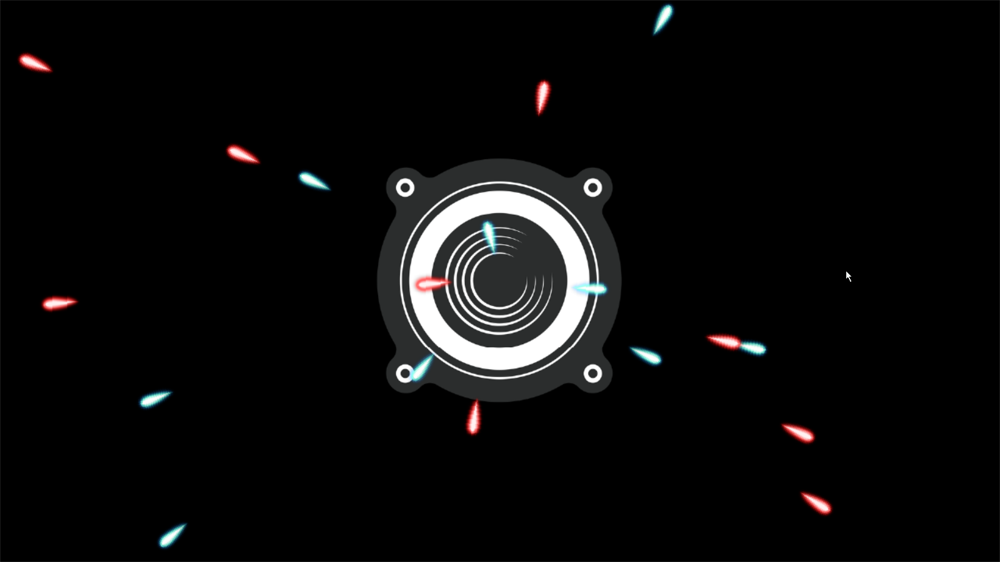
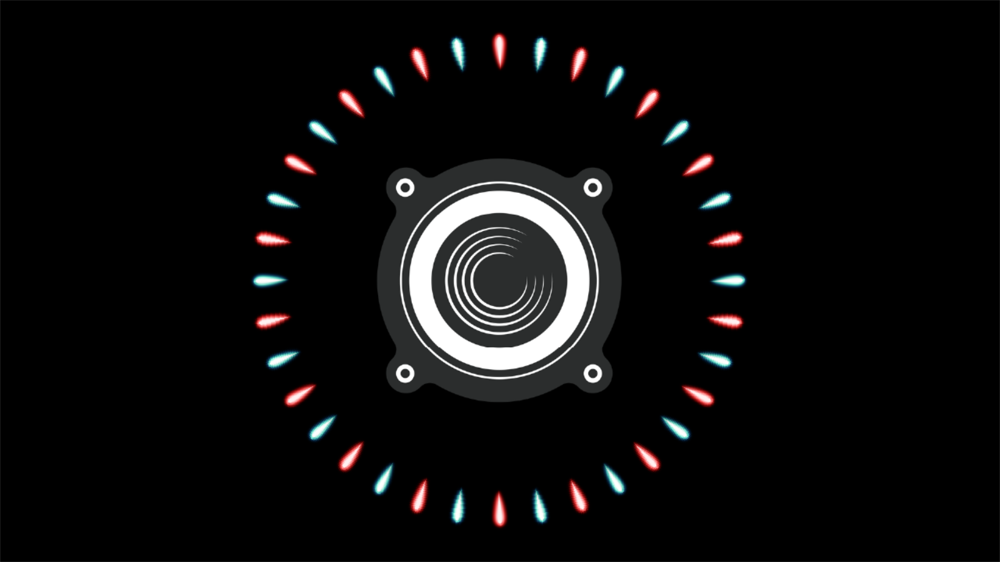

## Audio and Music Manager

I am [Alejandro Moreno](https://www.linkedin.com/in/alejandro-moreno-0b01ab1b2/), student of the [Bachelor’s Degree in Video Games by UPC at CITM](https://www.linkedin.com/school/centre-de-la-imatge-i-la-tecnologia-multim-dia-upc-/mycompany/). This content is generated for the second year’s subject Project 2, under supervision of lecturer [Ramón Santamaria](https://www.linkedin.com/in/raysan/).

## Intoduction

This research talks about the implementation of the Audio Manager to manage all music and sound effects of a video game, and the internal functioning of the functions used by the Audio Manager. 

The main focus of this research is: 

* Develop a music manager
* Every entity can potentially generate audio
* Discard entities that are too far
* Check camera position/zoom to play the audio spatially
* Music Manager: Chain a music with fading

## Music Manager

The music manager is a module or code structure selfmade that allow the developer to handle different audio inputs from several sources, load and erasing those fx’s or audio at will. In this research we will be using audio.h and audio.cpp. In orther to follow the explanation it’s recommended to take a look to the [SDL_Mixer](https://www.libsdl.org/projects/SDL_mixer/docs/SDL_mixer.pdf) documentation.

## Spatial audio

Spatial Audio is any audio which gives you a sense of space beyond conventional stereo, allowing the user to pinpoint where sound is coming from, whether this is above, below, or a full 360 degrees around you. For example stereo allows you to hear things in front left and right, but you can’t get a sense of surround, height or sounds from below you. With the introduction of the 3rd dimension, you have a sense of the exact location of sound sources from all around. This definition also appeals to 3D audio.

Let's see the differences with the other types of audio:

The stereo audio have 2 channels:


The surround sound have 5-7 channels:


The spatial sound full 360 degrees around you:


Spatial audio is a manipulation of the sound that makes the feeling of a 3D space, you can listen [here](https://upfa3d.wordpress.com/category/spatial-audio/) videos that show this effect.

You can also check the audio difference in the following videos:

* [LST 3D Sound Demo](https://www.youtube.com/watch?v=QFaSIti5_d0)

* [Call of Duty Warzone Sound: Stereo vs. Dolby Atmos vs. Windows Sonic](https://www.youtube.com/watch?v=xLxjRnpxhB0)

* [Resident Evil 2 Remake: Windows Sonic vs Dolby Atmos vs DTS Headphone:X [HRTF]](https://www.youtube.com/watch?v=cKx4UOyCDpo)

## Core concepts & functions

The audio manager developed in this research is based on the following SDL_MIXER functions extracted from section 4 of the function [documentation](https://www.libsdl.org/projects/SDL_mixer/docs/SDL_mixer_6.html).

#### Channels

* **Mix_AllocateChannels:** Set the number of channels being mixed. This can be called multiple times, even with sounds playing. If numchans is less than the current number of channels, then the higher channels will be stopped, freed, and therefore not mixed any longer. If passing in zero will free all mixing channels, however music will still play.
   * **Function:** *int **Mix_AllocateChannels**(int numchans)*
   ```c
   int result = Mix_AllocateChannels(numchans);
   if (result < 0)
   {
		   fprintf(stderr, "Unable to allocate mixing channels: %s\n", SDL_GetError());
		   active = false;
		   ret = true;
   }
   // int numchans: Number of channels to allocate for mixing 
   // A negative number will not do anything, it will tell you how many channels are currently allocated
   ```
   * **Returns:** The number of channels allocated.

* **Mix_Volume:** Set the volume for any allocated channel. If channel is -1 then all channels at are set at once. The volume is applied during the final mix, along with the sample volume. So setting this volume to 64 will halve the output of all samples played on the specified channel. All channels default to a volume of 128, which is the max. Newly allocated channels will have the max volume set, so setting all channels volumes does not affect subsequent channel allocations.
   * **Function:** *int **Mix_Volume**(int channel, int volume)*
   ```c
   Mix_Volume(channel, volume)
   // int channel: Channel to set mix volume for. -1 will set the volume for all allocated channels
   // int volume: The volume to use from 0 to MIX_MAX_VOLUME(128). If less than 0 then the volume will not be set
   ```
   * **Return:** Current volume of the channel. If channel is -1, the average volume is returned.

* **Mix_PlayChannel:** Play chunk on channel, or if channel is -1, pick the first free unreserved channel. The sample will play for loops+1 number of times, unless stopped by halt, or fade out, or setting a new expiration time of less time than it would have originally taken to play the loops, or closing the mixer.
   * **Function:** *int **Mix_PlayChannel**(int channel, Mix_Chunk *chunk, int loops)*
   ```c
   Mix_PlayChannel(channel, fx[id - 1], repeat);
   // int channel: Channel to play on, or -1 for the first free unreserved channel
   // Mix_Chunk * chunk: Sample to play
   // int loops: Number of loops, -1 is infinite loops, passing one here plays the sample twice (1 loop)
   ```
   * **Return:** The channel the sample is played on. On any errors, -1 is returned.

* **Mix_Playing:** Tells you if channel is playing, or not.
   * **Function:** *int **Mix_Playing**(int channel)*
   ```c
   Mix_Playing(channel)
   // int channel: Channel to test whether it is playing or not,
   // -1 will tell you how many channels are playing
   ```
   * **Return:** Zero if the channel is not playing. Otherwise if you passed in -1, the number of channels playing is returned. If you passed in a specific channel, then 1 is returned if it is playing.

#### Music

* **Mix_FadeInMusic:** Fade in over ms milliseconds of time, the loaded music, playing it loop times through from start to finish.
The fade in effect only applies to the first loop. Any previous music will be halted, or if it is fading out it will wait (blocking) for the fade to complete.
   * **Function:** *int **Mix_FadeInMusic**(Mix_Music *music, int loops, int ms)*
   ```c
   if(Mix_FadeInMusic(music, -1, (int) (fadeTime * 1000.0f)) < 0)
   {
	LOG("Cannot fade in music %s. Mix_GetError(): %s", path, Mix_GetError());
	ret = false;
   }
   // Mix_Music *music: Pointer to Mix_Music to play
   // int loops: Number of times to play through the music, -1 plays the music forever
   // int ms: Milliseconds for the fade-in effect to complete
   ```
   * **Return:** 0 on success, or -1 on errors.
 
* **Mix_FadeOutMusic:** Gradually fade out the music over ms milliseconds starting from now. The music will be halted after the fade out is completed. Only when music is playing and not fading already are set to fade out, including paused channels.
   * **Function:** *int **Mix_FadeOutMusic**(int ms)*
    ```c
    Mix_FadeOutMusic(int(fadeTime * 1000.0f));
    // int ms: Milliseconds of time that the fade-out effect should 
    // take to go to silence, starting now
    ```
   * **Return:** 1 on success, 0 on failure.

* **Mix_VolumeMusic:** Set the volume to volume, if it is 0 or greater, and return the previous volume setting. Setting the volume during a fade will not work.
   * **Function:**  *int **Mix_VolumeMusic**(int volume)*
   ```c
   Mix_VolumeMusic(volumeMusic);
   // int volume: Music volume, from 0 to MIX_MAX_VOLUME(128)
   ```
   * **Return:** The previous volume setting.

#### Effects

* **Mix_SetPosition:** This effect emulates a simple 3D audio effect. It's not all that realistic, but it can help improve some level of realism. By giving it the angle and distance from the camera's point of view, the effect pans and attenuates volumes. If you are looking for better positional audio, using OpenAL is suggested.
   * **Function:** *int **Mix_SetPosition**(int channel, Sint16 angle, Uint8 distance)*
   ```c
   Mix_SetPosition(channel, angle, distance);
   // int channel: Channel number to register this effect on,
   // Use MIX_CHANNEL_POST to process the postmix stream
   // Sint16 angle: Direction in relation to forward from 0 to 360 degrees,
   // larger angles will be reduced to this range using angles % 360,
   // 0 = directly in front / 90 = directly to the right / 180 = directly behind / 270 = directly to the left
   // Uint8 distance: The distance from the listener, from 0(near/loud) to 255(far/quiet) 
   ```
   * **Return:** Zero on errors, such as an invalid channel.

## Audio Manger Functions

The audio manager uses all the following functions: 

```c

// Constructor
Audio();

// Destructor
virtual ~Audio();

// Called before render is available
bool Awake(pugi::xml_node&);

// Called before quitting
bool CleanUp();
void UnloadFxs();
void Unload1Fx(int index);

// Play a music file
bool PlayMusic(const char* path, float fadeTime = DEFAULT_MUSIC_FADE_TIME);
void PauseMusic();
void ResumeMusic();
void StopMusic();
void RewindMusic();

void MusicPos(double second);
void SetMusicVolume(int volume);

// Load a WAV in memory
unsigned int LoadFx(const char* path);

// Play a previously loaded WAV
bool PlayFx(int channel, unsigned int fx, int repeat = 0, int volume = -1);

void SetDistanceFx(int channel, int angle, uint distance, uint maxDistance);
int SetChannel();

void DeleteChannel();
bool RemoveChannel();

void PauseFx(int channel);
void ResumeFx(int channel);
void StopFx(int channel);

void ChangeMusicVolume(int volume);
void ChangeFxVolume(int volume);

// Save and Load volume
bool LoadState(pugi::xml_node& node);
bool SaveState(pugi::xml_node& node)const;

// Return volume music
int GetVolumeMusic() { return volumeMusic; }
bool GetPendingToDelete() { return pendingToDelete; }
```
*Module Audio header file*

In this section we will explain the functions related to "spatial audio" and channel assignment.

* **PlayMusic:** This function takes care of the transition between songs using  a fade of out and in with the SDL functions "Mix_FadeOutMusic" and "Mix_FadeInMusic". First it checks if there is any song running, if so, the music fades the time in ms that we have indicated as an input parameter to the function, then it frees the song from memory and loads the new one by playing it with a fade in. 
   * **Function:** *bool **PlayMusic**(const char* path, float fadeTime = DEFAULT_MUSIC_FADE_TIME)* 
   * **Input parameters:** 
      * const char* path: It is the relative path of the file.
      * float fadeTime: Is the time in seconds that the fade will last
      * DEFAULT_MUSIC_FADE_TIME: 2.0f

   ```c
   
   // Play a music file
   bool Audio::PlayMusic(const char* path, float fadeTime)
   {
   	bool ret = true;
   
   	if(!active)
   		return false;
   
   	if(music != NULL)
   	{
   		if(fadeTime > 0.0f)
   		{
   			Mix_FadeOutMusic(int(fadeTime * 1000.0f));
   		}
   		else
   		{
   			Mix_HaltMusic();
   		}
   		
   		// This call blocks until fade out is done
   		Mix_FreeMusic(music);
   	}
   
   	music = Mix_LoadMUS(path);
   
   	if(music == NULL)
   	{
   		LOG("Cannot load music %s. Mix_GetError(): %s\n", path, Mix_GetError());
   		ret = false;
   	}
   	else
   	{
   		if(fadeTime > 0.0f)
   		{
   			if(Mix_FadeInMusic(music, -1, (int) (fadeTime * 1000.0f)) < 0)
   			{
   				LOG("Cannot fade in music %s. Mix_GetError(): %s", path, Mix_GetError());
   				ret = false;
   			}
   		}
   		else
   		{
   			if(Mix_PlayMusic(music, -1) < 0)
   			{
   				LOG("Cannot play in music %s. Mix_GetError(): %s", path, Mix_GetError());
   				ret = false;
   			}
   		}
   	}
   
   	LOG("Successfully playing %s", path);
   	return ret;
   }
   ```

* **PlayFx:** This function takes care of playing a sound effect. First check if the sound effect is in the sound list of the audio manager, if so, check if that sound is already playing so that the audio doesn't collapse. Then check if the sound to be played has a prefixed volume and assigns this volume. After, lower the volume if the channel volume is higher than the maximum volume so that all sounds sound at maximum at that intensity. Finally the effect is reproduced as many times as has been indicated.
   * **Function:** *bool **PlayFx**(int channel, unsigned int fx, int repeat = 0, int volume = -1)*
   * **Input parameters:** 
      * int channel: Channel to play on, or -1 for the first free unreserved channel
      * unsigned int fx: The id of the sound list
      * int repeat: Number of loops, -1 is infinite loops, passing one here plays the sample twice (1 loop)
      * int volume: Music volume, from 0 to MIX_MAX_VOLUME(128)

   ```c
   
   // Play WAV
   bool Audio::PlayFx(int channel, unsigned int id, int repeat, int volume)
   {
   	bool ret = false;
   
   	if(!active)
   		return false;
   
   	if(id > 0 && id <= fx.Count())
   	{
   		// If Mix_Playing(-1) check all channels
   		// TODO 4: Check if the channel isn't playing
   		if (Mix_Playing(channel) == 0)
   		{
   			// TODO 4: Check if volume is hardcoded and 
   			// lower the volume if the channel volume is higher than the maximum volume  
   			if (volume != -1) Mix_Volume(channel, volume);
   			if (Mix_Volume(channel, -1) > volumeFx) 
   				Mix_Volume(channel, volumeFx);
   			Mix_PlayChannel(channel, fx[id - 1], repeat);
   		}
   	}
   
   	return ret;
   }
   ```

* **SetDistanceFx:** Assign the distance and direction to which the entity of the listener is located. Knowing the distance at which the entity is from the listener and the maximum distance at which we want the sound to stop being heard, we can make a rule of three to know the distance in units that the "Mix_SetPosition" function uses. Being 0 = very close, 254 = far away, 255 = out of range (Volume = 0).
   * **Function:** *void **SetDistanceFx**(int channel, int angle, uint distance, uint maxDistance)*
   * **Input parameters:** 
      * int channel: Channel to play on, or -1 for the first free unreserved channel
      * int angle: Direction in relation to forward from 0 to 360 degrees
      * uint distance: The distance from the listener, from 0(near/loud) to 255(far/quiet)
      * uint maxDistance: From what distance do you stop hearing the sound
    
   ```c
   void Audio::SetDistanceFx(int channel, int angle, uint distance, uint maxDistance)
   {
   	distance = distance * 255 / maxDistance;
   	if (distance > 255) distance = 255;
   	Mix_SetPosition(channel, angle, distance);
   }
   ```

* **SetChannel:** Assign a different channel to each entity and when all available channels are assigned the function create 10 new ones. The -1 is security system because without him the last channel doesn't play. 
   * **Function:** *int **SetChannel**()*

   ```c
   
   int Audio::SetChannel()
   {
   	if (numChannels < maxNumChannels - 1)
   	{
   		numChannels++;
   		return numChannels;
   	}
   	else
   	{
   		maxNumChannels += 10;
   		Mix_AllocateChannels(maxNumChannels);
   		numChannels++;
   		return numChannels;
   	}
   
   	return -1;
   }
   ```
   
 * **RemoveChannel:** Restart channels as they were at the beginning. First release all channels with Mix_AllocateChannels(0) and after create a 10 new ones. This will only happen if no channel is playing because otherwise the sound would suddenly stop hearing and transmit bad feedback. To do this check we go through all the channels with the function Mix_Playing(-1). Clearly this function will only be called if there is a notice that a channel will no longer be used.
   * **Function:** *bool **RemoveChannel**()*  
   
   ```c
   
   bool Audio::RemoveChannel()
   {
   	if (Mix_Playing(-1) == 0)
   	{
   		numChannels = 0;
   		maxNumChannels = 10;
   		Mix_AllocateChannels(0);
   		Mix_AllocateChannels(maxNumChannels);
   		pendingToDelete = false;
   
   		return true;
   	}
   
   	return false;
   }
   ```
   
 * **DeleteChannel:** Takes care of changing the "pendingToDelete" variable to true. This variable tells the audio manager that it must call the "RemoveChannel" function to release channels.
   * **Function:** *voidDeleteChannel**()*
   
   ```c
   void Audio::DeleteChannel()
   {
   	pendingToDelete = true;
   }
   ```
   
## Extra Functions

The following functions are small functions for the developer to have full control of the sound reproduction:

```c

void Audio::PauseMusic()
{
	Mix_PauseMusic();
}
void Audio::ResumeMusic()
{
	Mix_ResumeMusic();
}
void Audio::StopMusic()
{
	Mix_HaltMusic();
}
void Audio::RewindMusic()
{
	Mix_RewindMusic();
}
// Set the position of the currently playing music
void Audio::MusicPos(double second)
{
	Mix_SetMusicPosition(second);
}
// Set the volume to volume
void Audio::SetMusicVolume(int volume)
{
	Mix_VolumeMusic(volume);
}

// TODO 7: Up/Down Music volume 
void Audio::ChangeMusicVolume(int volume)
{
	volumeMusic += volume;
	if (volumeMusic > MIX_MAX_VOLUME) volumeMusic = MIX_MAX_VOLUME;
	if (volumeMusic < 0) volumeMusic = 0;
	Mix_VolumeMusic(volumeMusic);
}
// TODO 7: Up/Down Fx volume 
void Audio::ChangeFxVolume(int volume)
{
	volumeFx += volume;
	if (volumeFx > MIX_MAX_VOLUME) volumeFx = MIX_MAX_VOLUME;
	if (volumeFx < 0) volumeFx = 0;
}

// Extra functions Fx
void Audio::PauseFx(int channel)
{
	Mix_Pause(channel);
}
void Audio::ResumeFx(int channel)
{
	Mix_Resume(channel);
}
void Audio::StopFx(int channel)
{
	Mix_HaltChannel(channel);
}

// Load/Save
bool Audio::LoadState(pugi::xml_node& node)
{
	volumeMusic = node.child("music").attribute("volume").as_int(volumeMusic);
	volumeFx = node.child("fx").attribute("volume").as_int(volumeFx);
	Mix_VolumeMusic(volumeMusic);
	return true;
}
bool Audio::SaveState(pugi::xml_node& node) const
{
	node.child("music").attribute("volume").set_value(volumeMusic);
	node.child("fx").attribute("volume").set_value(volumeFx);
	return true;
}
```

## Exercises - TODO's

Now that we have reviewed the functions and concepts we will use, we can start with the exercise. The program is a bullet system in which each entity is assigned a different channel. All bullets spawn from the center of the screen and depending on the direction in which they go the listener will be heard from one direction or another, thus getting to check the spatial sound in 360 degrees. 

There are three ways to spawn bullets:

* The space key: Spawn a bullet to the east, and the next one has an offset of 10 degrees.


* The mouse button: Spawn a bullet towards the direction of the mouse position.



* The A key: Spaw 36 bullets in all directions forming a perfect circle.



#### TODO 1: 

Activate stereo mode. This TODO is for the developer to know that if the stereo mode is not activated they will not get a 3D sound. All you have to do is change the third input parameter of the function to the number 2 that is now.

```c
bool Audio::Awake(pugi::xml_node& config)
{
	// TODO 1: Activate stereo mode
	if(Mix_OpenAudio(MIX_DEFAULT_FREQUENCY, MIX_DEFAULT_FORMAT, 2, 2048) < 0)
	{
		LOG("SDL_mixer could not initialize! SDL_mixer Error: %s\n", Mix_GetError());
		active = false;
		ret = true;
	}
}
```

#### TODO 2:

Create as many channels as you need and and free them. With this function the developer will be able to create as many channels as he needs so that the audio manager can then mix them. Finally release the channels.

```c
bool Audio::Awake(pugi::xml_node& config)
{
	// TODO 2: Create as many channels as you need 
	int result = Mix_AllocateChannels(maxNumChannels);
	if (result < 0)
	{
		fprintf(stderr, "Unable to allocate mixing channels: %s\n", SDL_GetError());
		active = false;
		ret = true;
	}
}

bool Audio::CleanUp()
{
	// TODO 2: Free all channels
	Mix_AllocateChannels(0);
}
```

#### TODO 3:

Create the SetChannel() function: Assign a different channel to each entity and when all available channels are assigned the function must create 10 new ones and call it to the entity system

```c
// TODO 3: Assign a different channel to each entity and when all available channels 
// are assigned the function must create 10 new ones
int Audio::SetChannel()
{
	if (numChannels < maxNumChannels - 1)
	{
		numChannels++;
		return numChannels;
	}
	else
	{
		maxNumChannels += 10;
		Mix_AllocateChannels(maxNumChannels);
		numChannels++;
		return numChannels;
	}

	return -1;
}

void Scene::AddBullet(float angle)
{
	// TODO 3: Assign new channel
	b->channel = app->audio->SetChannel();
}
```

#### TODO 4

You must create a control system that verifies if the channel isn't playing, in this case, check if volume is hardcoded and lower the volume if the channel volume is higher than the maximum volume.

```c
// TODO 4: Check if the channel isn't playing
if (Mix_Playing(channel) == 0)
{
	// TODO 4: Check if volume is hardcoded and 
	// lower the volume if the channel volume is higher than the maximum volume  
	if (volume != -1) Mix_Volume(channel, volume);
	if (Mix_Volume(channel, -1) > volumeFx) 
		Mix_Volume(channel, volumeFx);
	Mix_PlayChannel(channel, fx[id - 1], repeat);
}
```

#### TODO 5

Once each entity has its own channel we are going to create the SetDistanceFx() function that will be in charge of simulating the spatial audio. In the gameplay scene must fill the input parameters required by the function.

```c
// TODO 5: Assign the distance and direction to which the entity of the listener is located 
// 0 = very close, 254 = far away, 255 = out of range (Volume = 0)
void Audio::SetDistanceFx(int channel, int angle, uint distance, uint maxDistance)
{
	distance = distance * 255 / maxDistance;
	if (distance > 255) distance = 255;
	Mix_SetPosition(channel, angle, distance);
}

bool Scene::Update(float dt)
{
	// TODO 5: Update distance and direction
	// 0 = directly in front / 90 = directly to the right / 180 = directly behind / 270 = directly to the left.
	for (item = bullets.start; item != NULL; item = item->next)
	{
		app->audio->SetDistanceFx(item->data->channel, item->data->angle + 90, DistanceToListener(player, item->data->pos), WINDOW_WIDTH/2);
	}	
}

```

#### TODO 6

Notify the audio manager that a channel can be released. When it receives the warning it sets the boolean variable to true, then, the scene will receive this notice back and ask the audio manager if no channel is playing, if so, the audio manager restart channels as they were at the beginning and channels will be reassigned.

```c
void Scene::DeleteBody(Bullet* body)
{
	// TODO 6: Notify the audio manager that a channel can be released 
	app->audio->DeleteChannel();
}

// TODO 6: Activate the boolean variable 
void Audio::DeleteChannel()
{
	pendingToDelete = true;
}

bool Scene::Update(float dt)
{
	// TODO 6: If an entity has been released a channel too
	if (app->audio->GetPendingToDelete() == true)
	{
		// TODO 6: If no channel is playing reassign the channels 
		if (app->audio->RemoveChannel())
		{
			for (item = bullets.start; item != NULL; item = item->next)
			{
				item->data->channel = app->audio->SetChannel();
			}
		}
	}

}

// TODO 6: Restart channels as they were at the beginning
bool Audio::RemoveChannel()
{
	if (Mix_Playing(-1) == 0)
	{
		numChannels = 0;
		maxNumChannels = 10;
		Mix_AllocateChannels(0);
		Mix_AllocateChannels(maxNumChannels);
		pendingToDelete = false;

		return true;
	}

	return false;
}
```

#### TODO 7

Finally and as an extra, you will have to create a function to regulate the general volume of the music and the Fx. To check that it works, try calling them from the gameplay scene.  

```c
// TODO 7: Up/Down Music volume 
void Audio::ChangeMusicVolume(int volume)
{
	volumeMusic += volume;
	if (volumeMusic > MIX_MAX_VOLUME) volumeMusic = MIX_MAX_VOLUME;
	if (volumeMusic < 0) volumeMusic = 0;
	Mix_VolumeMusic(volumeMusic);
}
// TODO 7: Up/Down Fx volume 
void Audio::ChangeFxVolume(int volume)
{
	volumeFx += volume;
	if (volumeFx > MIX_MAX_VOLUME) volumeFx = MIX_MAX_VOLUME;
	if (volumeFx < 0) volumeFx = 0;
}

bool Scene::Update(float dt)
{
	// TODO 7: Up/Down Music
	if (app->input->GetKey(SDL_SCANCODE_KP_PLUS) == KEY_DOWN)
		app->audio->ChangeMusicVolume(10);
	if (app->input->GetKey(SDL_SCANCODE_KP_MINUS) == KEY_DOWN)
		app->audio->ChangeMusicVolume(-10);
	// TODO 7: Up/Down Fx	
	if (app->input->GetKey(SDL_SCANCODE_UP) == KEY_DOWN)
		app->audio->ChangeFxVolume(10);
	if (app->input->GetKey(SDL_SCANCODE_DOWN) == KEY_DOWN)
		app->audio->ChangeFxVolume(-10);
}
```

## Conclusions

The Audio and Music Manager is a very simple way to control all the sound that is played in your game. In a very easy way you can achieve more realistic results that provide a better gameplay to the gaming experience. But if you really are interested into this, I encourage you to test for yourself [OpenAL](https://www.openal.org) and have a little fun with it. It is a tool created specifically to work with 3D audio so it will multiply the level we were able to reach today for sure!

Thank you for your time and hope you were able to learn something from this guide. Until next time!

## Documentation

[SDL_Mixer_PDF](https://www.libsdl.org/projects/SDL_mixer/docs/SDL_mixer.pdf)

[SDL_Mixer_Doc](https://www.libsdl.org/projects/SDL_mixer/docs/SDL_mixer_6.html)

[Gamasutra](https://www.gamasutra.com/blogs/RobBridgett/20190619/344991/The_Positive_Future_of_Spatial_Audio_for_Games.php)

[GameDev](https://www.gamedev.net/forums/topic/537789-sdl-mix_setdistance-issue/)

[GDC Conference](https://www.youtube.com/watch?v=L2Kckjq0Gcs)
